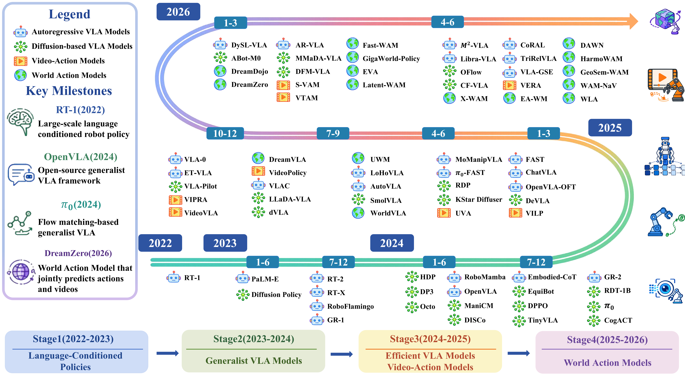
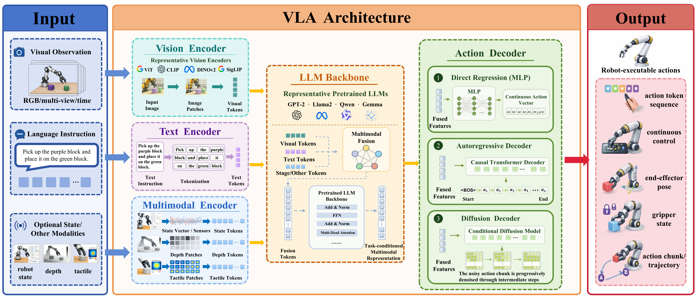

# 🤖 A Survey of Multi-Paradigm Approaches Toward General-Purpose Embodied Intelligence


### 🌟 A comprehensive review of Vision-Language-Action Models and emerging paradigms for general-purpose embodied intelligence


Vision-Language-Action Models (VLAs) provide a unified framework that connects visual perception, language understanding, and robotic control. 
This repository accompanies our survey, presenting a systematic review of the evolution of embodied intelligence, covering VLA architectures, efficient deployment, scene generalization, capability enhancement, and emerging predictive paradigms including Video-Action Models (VAMs) and World-Action Models (WAMs).


---

# 📰 News


- `2026.08` Repository initialized.
- More updates will be released as the field evolves.


---

# 📌 Overview


This survey analyzes the evolutionary trajectory of general-purpose embodied intelligence from three perspectives:


- **🧩 VLA Architecture & Action Generation**
  - Vision-Language Representation
  - Multimodal Backbone
  - Action Decoding Paradigms


- **⚡ Deployment & Generalization**
  - Model Efficiency
  - Scene Generalization


- **🧠 Capability Expansion**
  - Reinforcement Learning
  - World Models
  - Long-Horizon Reasoning



<p align="center">
Figure 1. Chronological roadmap and key milestones of VLAs and WAM (2022–2026). The ffgure depicts the four-stage evolution of embodied policy
models—progressing from early language-conditioned control, open generalist VLAs, and reasoning-enhanced architectures, to video- and worldaware
 agents leveraging world dynamics.
</p>

---

# 📑 Table of Contents


- [🧩 VLA Architecture & Action Generation](#-vla-architecture--action-generation)
  - [Vision-Language Representation](#vision-language-representation)
  - [Multimodal Backbone](#multimodal-backbone)
  - [Action Decoding Paradigms](#action-decoding-paradigms)


- [⚡ Deployment & Generalization](#-deployment--generalization)
  - [Model Efficiency](#model-efficiency)
  - [Scene Generalization](#scene-generalization)


- [🧠 Capability Expansion](#-capability-expansion)
  - [Reinforcement Learning](#reinforcement-learning)
  - [World Models](#world-models)
  - [Long-Horizon Reasoning](#long-horizon-reasoning)


- [🏭 Applications](#-applications)


- [🔭 Challenges and Future Directions](#-challenges-and-future-directions)


- [📖 Citation](#-citation)


# 🧩 VLA Architecture & Action Generation


VLAs integrate visual observations, language instructions, and robot states into a unified decision-making framework.

This section reviews:

- Vision encoders
- Multimodal backbones
- Action decoding paradigms
    - Autoregressive generation
    - Diffusion-based generation
    - Continuous action modeling



<p align="center">
Figure 2. Architectural overview of VLAs. Encoding: Heterogeneous inputs are encoded and aligned via cross-modal fusion. Multimodal Reasoning:
Transformer-based VLM/LLM backbones process fused latent features for high-level decision-making. Action Decoding: Latent representations are
mapped into executable robot commands via direct regression, autoregressive prediction, or diffusion/ffow matching.
</p>

---

# ⚡ Deployment & Generalization


Large-scale VLAs introduce significant computational and memory requirements, limiting real-world deployment.

This section summarizes:

- Lightweight architectures
- Model compression
- Token optimization
- Quantization
- Knowledge distillation


---

# 🧠 Capability Expansion


Reliable embodied intelligence requires robust performance beyond training environments.

We review approaches including:

- Geometric representation learning
- Object-centric perception
- Language-scene alignment
- Test-time adaptation
- Open-world generalization


---


# 🏭 Applications


Representative applications include:


🏠 Household and Service Robotics

🏥 Healthcare and Surgical Robotics

🚗 Autonomous Driving and Navigation

🏭 Industrial Manipulation


---

# 🔭 Challenges and Future Directions


Current embodied intelligence systems still face challenges in:


- Robust open-world generalization
- Efficient real-time deployment
- Long-horizon autonomous execution
- Data feedback and continual learning
- System-level integration


---

# 📖 Citation


If you find this survey useful, please consider citing:


```bibtex
@article{shi2026embodied,
  title={A Survey of Multi-Paradigm Approaches Toward General-Purpose Embodied Intelligence:
  Panoramic Overview and Evolutionary Trajectory},
  author={Shi, Ruyu and others},
  journal={IEEE Transactions on Robotics},
  year={2026}
}
