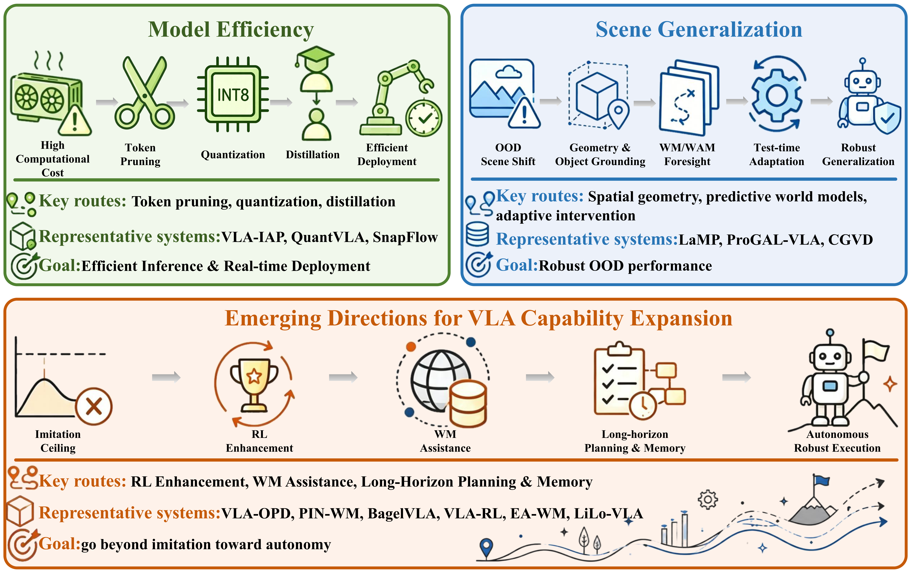

# 🤖 Multi-Paradigm Approaches Toward General-Purpose Embodied Intelligence: Panoramic Overview and Evolutionary Trajectory

### ⭐ Give us a star if you find this survey useful! ⭐

This repository accompanies **Multi-Paradigm Approaches Toward General-Purpose Embodied Intelligence: Panoramic Overview and Evolutionary Trajectory**. The survey examines how **action-generation architectures, deployment efficiency, scene generalization, and predictive modeling** jointly shape the capabilities and real-world applicability of Vision-Language-Action (VLA) models.

We review core VLA components and action decoders, clarify the relationships among VLAs, Video-Action Models (VAMs), and World Action Models (WAMs), and discuss benchmarks, capability enhancement, application requirements, and future research directions. No single action-generation paradigm is uniformly preferable: semantic modeling, control precision, and inference cost must be balanced for the target task.

📄 [Read the survey](paper/VLA_Embodied_Intelligence_Survey.pdf) · 🏆 [Online benchmark leaderboard](https://embodiedbench.vercel.app/en)

We will continue to update this repository with advances in embodied intelligence research. We hope it provides a useful reference for researchers and practitioners working toward robust and adaptive robotic policies.

---

## 📰 News

- `2026.09` Updated the survey overview, architectural taxonomy, figure explanations, and outlook to match the revised manuscript; added the accompanying benchmark leaderboard.
- `2026.08` Repository initialized.
- More updates will be released as the field evolves.

---

## 📌 Overview

The survey follows the evolution from language-conditioned robot policies to generalist and efficient VLAs, and toward predictive embodied decision-making with VAMs and WAMs. It is organized around the following topics:

- **VLA architecture and evolution (Section II):** vision-language encoding, LLM backbones, and direct-regression, autoregressive, and diffusion/flow-matching action decoding; VAMs and WAMs; datasets and benchmarks.
- **Deployment and generalization (Section III):** model efficiency, scene generalization, and capability expansion through reinforcement learning, world models, and long-horizon reasoning.
- **Core challenges (Section IV):** generalization, long-horizon reliability, real-time deployment, continual learning, physical modeling, agentic capability, and data availability.
- **Applications (Section V):** household service, surgical and medical assistance, autonomous driving and navigation, and industrial manufacturing.
- **Future outlook (Section VI):** coordinated advances in models, data, physical grounding, deployment, and Agentic Robot Learning.

The [online leaderboard](https://embodiedbench.vercel.app/en) complements the survey by aggregating publicly reported results across multiple benchmarks. Benchmark scores provide only a partial view of real-world capability; closed-loop stability, robustness to distribution shifts, and computational efficiency also matter.

<b>Fig. 1.</b> Chronological roadmap of representative robot policies, VLAs, VAMs, and WAMs (2022–2026). The four overlapping stages trace language-conditioned policies (2022–2023), generalist VLAs (2023–2024), efficient VLAs and VAMs (2024–2025), and WAMs (2025–2026). Colors and icons distinguish action-generation and predictive-modeling paradigms. The roadmap uses each method’s first public release year and highlights RT-1, OpenVLA, π₀, and DreamZero as milestones.

---

## 📑 Table of Contents

- [🧩 VLA Architecture & Action Generation](#vla-architecture-action-generation)
  - [Core Components and Action Decoders](#core-components-and-action-decoders)
  - [Autoregressive VLA](#autoregressive-vla)
  - [Diffusion-based VLA](#diffusion-based-vla)
  - [Video-Action Models (VAMs)](#video-action-models-vams)
  - [World Action Models (WAMs)](#world-action-models-wams)
  - [Datasets and Benchmarks](#datasets)
- [⚡ Deployment & Generalization](#deployment-generalization)
  - [Model Efficiency](#model-efficiency)
  - [Scene Generalization](#scene-generalization)
  - [🧠 Capability Expansion](#capability-expansion)
    - [Reinforcement Learning](#reinforcement-learning)
    - [World Models](#world-models)
    - [Long-Horizon Reasoning](#long-horizon-reasoning)
- [🚧 Core Challenges](#challenges)
- [🏭 Applications](#applications)
- [🔭 Future Outlook](#future-directions)
- [📖 Citation](#citation)
- [📄 Paper](#paper)

## 🧩 VLA Architecture & Action Generation

### Core Components and Action Decoders

A typical VLA combines a **vision encoder**, a **language instruction interface**, an **LLM backbone**, and an **action decoder**. Visual observations and language tokens, optionally supplemented by proprioception, depth, tactile input, or history, are fused into task-conditioned representations for robot control.

Action decoding follows three complementary routes:

- **Direct regression (MLP):** maps fused features directly to continuous actions, offering simple, low-latency inference but limited expressiveness for complex action distributions.
- **Autoregressive decoding:** predicts serialized actions conditioned on preceding tokens and multimodal context, supporting language-model reuse while facing sequential decoding cost and, for discretized actions, quantization error.
- **Diffusion and related flow-matching decoding:** models multimodal action distributions through continuous generation, with a trade-off between fine-grained control and iterative inference cost. Flow matching is closely related to diffusion, but uses a distinct objective and generative mechanism.

The paper emphasizes autoregressive and diffusion-based VLA families and then examines **VAMs and WAMs as overlapping predictive extensions**. Action-decoder mechanisms and predictive-modeling paradigms describe different aspects of a system; they do not form four mutually exclusive decoder categories.

<b>Fig. 2.</b> Core VLA architecture, from heterogeneous inputs to executable robot actions. Vision and text encoders, with optional state, depth, or tactile encoders, feed an LLM backbone that produces task-conditioned multimodal features. The action head uses direct regression, autoregressive prediction, or diffusion and related flow-matching generation to produce commands such as poses, gripper states, and action chunks.

### Autoregressive VLA

Autoregressive VLAs formulate robot action generation as conditional sequence prediction, representing actions as tokens or sequence units and predicting them causally from visual observations, language instructions, proprioceptive states, and historical context.

| Year | Venue | Paper | Website | Code |
|------|-------|-------|---------|------|
|2023|arXiv|[RT-2: Vision-Language-Action Models Transfer Web Knowledge to Robotic Control](https://arxiv.org/abs/2307.15818)|[🌐](https://robotics-transformer2.github.io/)|-|
|2024|arXiv|[Robotic Control via Embodied Chain-of-Thought Reasoning](https://arxiv.org/abs/2407.08693)|[🌐](https://embodied-cot.github.io/)|[💻](https://github.com/MichalZawalski/embodied-CoT/)|
|2024|arXiv|[RT-H: Action Hierarchies Using Language](https://arxiv.org/abs/2403.01823)|[🌐](https://rt-hierarchy.github.io/)|-|
|2025|arXiv|[CoT-VLA: Visual Chain-of-Thought Reasoning for Vision-Language-Action Models](https://arxiv.org/abs/2503.22020)|[🌐](https://cot-vla.github.io/)|-|
|2025|arXiv|[ChatVLA: Unified Multimodal Understanding and Robot Control with Vision-Language-Action Model](https://arxiv.org/abs/2502.14420)|[🌐](https://chatvla.github.io/)|[💻](https://github.com/tutujingyugang1/ChatVLA_public)|
|2025|arXiv|[Embodiment Transfer Learning for Vision-Language-Action Models](https://arxiv.org/abs/2511.01224)|[🌐](https://et-vla.github.io/)|-|
|2025|arXiv|[AutoVLA: A Vision-Language-Action Model for End-to-End Autonomous Driving with Adaptive Reasoning and Reinforcement Fine-Tuning](https://arxiv.org/abs/2506.13757)|[🌐](https://autovla.github.io/)|[💻](https://github.com/ucla-mobility/AutoVLA)|
|2025|arXiv|[LoHoVLA: A Unified Vision-Language-Action Model for Long-Horizon Embodied Tasks](https://arxiv.org/abs/2506.00411)|-|-|
|2026|arXiv|[Libra-VLA: Achieving Learning Equilibrium via Asynchronous Coarse-to-Fine Dual-System](https://arxiv.org/abs/2604.24921)|[🌐](https://libra-vla.github.io/)|-|
|2026|arXiv|[AR-VLA: True Autoregressive Action Expert for Vision-Language-Action Models](https://arxiv.org/abs/2603.10126)|[🌐](https://arvla.insait.ai/)|[💻](https://github.com/insait-institute/AR-VLA-lerobot)|

### Diffusion-based VLA

Diffusion-based action decoders typically generate continuous action chunks by iterative denoising conditioned on multimodal features. Related flow-matching methods also support continuous generation, with different training objectives and sampling dynamics. The broader diffusion-based VLA family additionally includes discrete diffusion approaches, such as LLaDA-VLA and dVLA; not every model in this family is a continuous-action diffusion decoder. Recent work explores action experts, model scaling, and fewer-step or coarse-to-fine generation to balance control quality and inference cost.

| Year | Venue | Paper | Website | Code |
|------|-------|-------|---------|------|
|2024|arXiv|[π0: A Vision-Language-Action Flow Model for General Robot Control](https://arxiv.org/abs/2410.24164)|[🌐](https://www.pi.website/blog/pi0)|-|
|2024|arXiv|[TinyVLA: Towards Fast, Data-Efficient Vision-Language-Action Models for Robotic Manipulation](https://arxiv.org/abs/2409.12514)|[🌐](https://tiny-vla.github.io/)|[💻](https://github.com/liyaxuanliyaxuan/TinyVLA)|
|2025|arXiv|[DexVLA: Vision-Language Model with Plug-In Diffusion Expert for General Robot Control](https://arxiv.org/abs/2502.05855)|[🌐](https://dex-vla.github.io/)|[💻](https://github.com/juruobenruo/DexVLA)|
|2025|arXiv|[SmolVLA: A Vision-Language-Action Model for Affordable and Efficient Robotics](https://arxiv.org/abs/2506.01844)|-|[💻](https://github.com/huggingface/lerobot)|
|2025|arXiv|[DreamVLA: A Vision-Language-Action Model Dreamed with Comprehensive World Knowledge](https://arxiv.org/abs/2507.04447)|-|[💻](https://github.com/Zhangwenyao1/DreamVLA)|
|2025|arXiv|[LLaDA-VLA: Vision Language Diffusion Action Models](https://arxiv.org/abs/2509.06932)|[🌐](https://wenyuqing.github.io/llada-vla/)|-|
|2025|arXiv|[dVLA: Diffusion Vision-Language-Action Model with Multimodal Chain-of-Thought](https://arxiv.org/abs/2509.25681)|-|-|
|2026|arXiv|[CF-VLA: Efficient Coarse-to-Fine Action Generation for Vision-Language-Action Policies](https://arxiv.org/abs/2604.24622)|-|[💻](https://github.com/EmbodiedAI-RoboTron/CF-VLA)|
|2026|arXiv|[Towards Deploying VLA without Fine-Tuning: Plug-and-Play Inference-Time VLA Policy Steering via Embodied Evolutionary Diffusion](https://arxiv.org/abs/2511.14178)|[🌐](https://rip4kobe.github.io/vla-pilot/)|-|
|2026|arXiv|[ProgressVLA: Progress-Guided Diffusion Policy for Vision-Language Robotic Manipulation](https://arxiv.org/abs/2603.27670)|-|-|

### Video Action Models (VAMs)

Video-Action Models use temporal evolution, object motion, and interaction information learned from video to guide action generation. The revised survey distinguishes two broad routes according to their dominant inference structure:

- **Coupled video-action generation:** shared latent representations or interacting generative branches connect video prediction with action generation.
- **Cascaded video planning to action conversion:** predicted visual states or latent trajectories are translated into executable actions by a policy decoder or an embodiment-specific inverse-dynamics model.

These routes can overlap, and some methods bypass full video generation at inference time. Large-scale human and internet video can provide useful temporal priors, but visually plausible predictions do not guarantee physically executable robot actions. Inference cost and closed-loop action alignment remain key limitations.

| Year | Venue | Paper | Website | Code |
|------|-------|-------|---------|------|
|2025|arXiv|[Unified Video Action Model](https://arxiv.org/abs/2503.00200)|[🌐](https://unified-video-action-model.github.io/)|-|
|2025|arXiv|[VILP: Imitation Learning with Latent Video Planning](https://arxiv.org/abs/2502.01784)|-|[💻](https://github.com/ZhengtongXu/VILP)|
|2025|arXiv|[ViPRA: Video Prediction for Robot Actions](https://arxiv.org/abs/2511.07732)|[🌐](https://vipra-project.github.io/)|[💻](https://github.com/sroutray/vipra)|
|2025|arXiv|[mimic-video: Video-Action Models for Generalizable Robot Control Beyond VLAs](https://arxiv.org/abs/2512.15692)|[🌐](https://mimic-video.github.io/)|[💻](https://github.com/mimic-video/mimic-video)|
|2025|arXiv|[VideoVLA: Video Generators Can Be Generalizable Robot Manipulators](https://arxiv.org/abs/2512.06963)|[🌐](https://videovla-nips2025.github.io/)|[💻](https://github.com/VideoVLA-Project/VideoVLA)|
|2025|arXiv|[CoVAR: Co-generation of Video and Action for Robotic Manipulation via Multi-Modal Diffusion](https://arxiv.org/abs/2512.16023)|-|-|
|2026|arXiv|[Turning Video Models into Generalist Robot Policies](https://arxiv.org/abs/2605.27817)|[🌐](https://vera.csail.mit.edu/)|[💻](https://github.com/sizhe-li/VERA)|
|2026|arXiv|[VTAM: Video-Tactile-Action Models for Complex Physical Interaction Beyond VLAs](https://arxiv.org/abs/2603.23481)|[🌐](https://plan-lab.github.io/projects/vtam/)|-|
|2026|arXiv|[DiT4DiT: Jointly Modeling Video Dynamics and Actions for Generalizable Robot Control](https://arxiv.org/abs/2603.10448)|[🌐](https://dit4dit.github.io/)|[💻](https://github.com/Mondo-Robotics/DiT4DiT)|
|2026|arXiv|[S-VAM: Shortcut Video-Action Model by Self-Distilling Geometric and Semantic Foresight](https://arxiv.org/abs/2603.16195)|[🌐](https://haodong-yan.github.io/S-VAM/)|[💻](https://github.com/Haodong-Yan/S-VAM)|

### World Action Models (WAMs)

World Action Models explicitly connect **world dynamics, action consequences, and control policies**, using anticipated environmental changes to generate, evaluate, or optimize actions. VAMs emphasize video temporal priors; WAMs emphasize the functional coupling between predicted future states and action decisions. Their boundaries overlap.

Future states may be represented as images, videos, latent features, object states, 3D geometry, or multimodal physical representations. The survey discusses explicit world-action prediction, efficient latent or training-time world supervision, and structured representations with tighter prediction-action interaction. Full future-video generation is not required at deployment: methods such as Fast-WAM retain predictive supervision while avoiding the full video-generation branch at inference time. Prediction errors and inference overhead remain important constraints.

| Year | Venue | Paper | Website | Code |
|------|-------|-------|---------|------|
|2025|arXiv|[Unified World Models: Coupling Video and Action Diffusion for Pretraining on Large Robotic Datasets](https://arxiv.org/abs/2504.02792)|[🌐](https://weirdlabuw.github.io/uwm/)|[💻](https://github.com/WEIRDLabUW/unified-world-model)|
|2026|arXiv|[DreamDojo: A Generalist Robot World Model from Large-Scale Human Videos](https://arxiv.org/abs/2602.06949)|[🌐](https://dreamdojo-world.github.io/)|[💻](https://github.com/NVIDIA/DreamDojo)|
|2026|arXiv|[Fast-WAM: Do World Action Models Need Test-time Future Imagination?](https://arxiv.org/abs/2603.16666)|[🌐](https://yuantianyuan01.github.io/FastWAM/)|[💻](https://github.com/yuantianyuan01/FastWAM)|
|2026|arXiv|[Unified 4D World Action Modeling from Video Priors with Asynchronous Denoising](https://arxiv.org/abs/2604.26694)|[🌐](https://sharinka0715.github.io/X-WAM/)|[💻](https://github.com/sharinka0715/X-WAM)|
|2026|arXiv|[Latent-WAM: Latent World Action Modeling for End-to-End Autonomous Driving](https://arxiv.org/abs/2603.24581)|-|-|
|2026|arXiv|[CKT-WAM: Parameter-Efficient Context Knowledge Transfer Between World Action Models](https://arxiv.org/abs/2605.06247)|-|[💻](https://github.com/YuhuaJiang2002/CKT-WAM)|
|2026|arXiv|[OA-WAM: Object-Addressable World Action Model for Robust Robot Manipulation](https://arxiv.org/abs/2605.06481)|-|-|
|2026|arXiv|[τ0-WM: A Unified Video-Action World Model for Robotic Manipulation](https://arxiv.org/abs/2606.01027)|[🌐](https://tau0-wm.github.io/)|[💻](https://github.com/sii-research/tau-0-wm)|
|2026|arXiv|[HarmoWAM: Harmonizing Generalizable and Precise Manipulation via Adaptive World Action Models](https://arxiv.org/abs/2605.10942)|[🌐](https://elbb-yu.github.io/HarmoWAM/)|-|

### Datasets and Benchmarks

Datasets and benchmarks have expanded from multi-task manipulation toward language-conditioned control, compositional long-horizon execution, and robustness under distribution shifts. The table below lists five core benchmarks discussed in the paper: Meta-World, LIBERO, LIBERO-Plus, RoboTwin 2.0, and CALVIN.

The updated survey also discusses **RLBench, RoboCasa365, RoboCasa-GR1, BEHAVIOR-1K, and SimplerEnv**, extending coverage to household tasks, humanoid tabletop manipulation, long-horizon activities, and simulation-based evaluation of real-world policies. Figure 3 shows this broader landscape. The accompanying [benchmark leaderboard](https://embodiedbench.vercel.app/en) aggregates publicly reported results; comparisons should account for each benchmark's task setting and evaluation protocol.

| Dataset | Year | Domain | Website | Code |
|---------|------|--------|---------|------|
| [Meta-World](https://arxiv.org/abs/1910.10897) | 2021 | Multi-task robotic manipulation with 50 simulated tasks | [🌐](https://meta-world.github.io/) | [💻](https://github.com/Farama-Foundation/Metaworld) |
| [LIBERO](https://arxiv.org/abs/2306.03310) | 2023 | Lifelong robot learning with diverse language-conditioned manipulation tasks | [🌐](https://libero-project.github.io/intro.html) | -  |
| [LIBERO-Plus](https://arxiv.org/abs/2510.13626) | 2025 | Robust VLA evaluation under environmental perturbations and distribution shifts | [🌐](https://sylvestf.github.io/LIBERO-plus/) |[💻](https://github.com/sylvestf/LIBERO-plus) |
| [RoboTwin 2.0](https://arxiv.org/abs/2506.18088) | 2025 | Bimanual manipulation with diverse object interaction scenarios | [🌐](https://robotwin-platform.github.io/) | [💻](https://github.com/robotwin-Platform/robotwin) |
| [CALVIN](https://arxiv.org/abs/2112.03227) | 2022 | Long-horizon language-conditioned robotic manipulation | [🌐](http://calvin.cs.uni-freiburg.de/) | - |

<b>Fig. 3.</b> Landscape of datasets and evaluation benchmarks. The inner ring groups benchmarks by their primary evaluation focus: basic manipulation, language-conditioned manipulation, and generalist embodied evaluation. The outer ring and visual callouts identify representative task environments, including the five core benchmarks listed above and the additional resources discussed in the revised survey. These groups describe evaluation emphasis rather than mutually exclusive capabilities.

---

## ⚡ Deployment & Generalization

Large-scale VLAs face challenges in computational efficiency and robust adaptation when deployed in real-world environments.

This section reviews approaches toward practical deployment and robust generalization, including:

- Model efficiency
    - Visual token pruning
    - Quantization
    - Knowledge distillation

- Scene generalization
    - Spatial-geometric perception and object-centric representation
    - World-model-assisted generalization
    - Inference-time intervention and multi-skill composition

### Model Efficiency

Model efficiency approaches reduce computation, memory usage, and generation cost through visual token pruning, quantization, and distillation. The revised survey distinguishes training-free and learned token selection, control-aware precision allocation, and action-, structure-, or sampling-oriented distillation. Model compression alone does not guarantee stable, low-latency closed-loop control; system scheduling and execution rates also matter.

#### Visual Token Pruning

Visual token selection must preserve action-relevant, temporal, and geometric information. The survey covers training-free pruning, training-based selection, and system-level combinations with scheduling, feature reuse, or quantization.

| Year | Venue | Paper | Website | Code |
|------|-------|-------|---------|------|
|2025|arXiv|[Action-aware Dynamic Pruning for Efficient Vision-Language-Action Manipulation](https://arxiv.org/abs/2509.22093)|-|[💻](https://github.com/TerryPei/VLA-ADP)|
|2025|arXiv|[SP-VLA: A Joint Model Scheduling and Token Pruning Approach for VLA Model Acceleration](https://arxiv.org/abs/2506.12723)|-|-|
|2025|arXiv|[The Better You Learn, The Smarter You Prune: Towards Efficient Vision-language-action Models via Differentiable Token Pruning](https://arxiv.org/abs/2509.12594)|[🌐](https://liauto-research.github.io/LightVLA/)|[💻](https://github.com/LiAutoAD/LightVLA)|
|2025|arXiv|[SpecPrune-VLA: Accelerating Vision-Language-Action Models via Action-Aware Self-Speculative Pruning](https://arxiv.org/abs/2509.05614)|-|-|
|2026|arXiv|[BFA++: Hierarchical Best-Feature-Aware Token Prune for Multi-View Vision Language Action Model](https://arxiv.org/abs/2602.20566)|-|-|
|2026|arXiv|[ETA-VLA: Efficient Token Adaptation via Temporal Fusion and Intra-LLM Sparsification for Vision-Language-Action Models](https://arxiv.org/abs/2603.25766)|-|-|
|2026|arXiv|[VLA-Pruner: Temporal-Aware Dual-Level Visual Token Pruning for Efficient Vision-Language-Action Inference](https://arxiv.org/html/2511.16449v1)|-|-|
|2026|arXiv|[Look Before Acting: Enhancing Vision Foundation Representations for Vision-Language-Action Models](https://arxiv.org/abs/2603.15618)|[🌐](https://deepvision-vla.github.io/)|-|
|2026|arXiv|[CogVLA: Cognition-Aligned Vision-Language-Action Model via Instruction-Driven Routing & Sparsification](https://arxiv.org/abs/2508.21046)|-|[💻](https://github.com/iLearn-Lab/NeurIPS25-CogVLA)|
|2026|arXiv|[VLA-IAP: Training-Free Visual Token Pruning via Interaction Alignment for Vision-Language-Action Models](https://arxiv.org/abs/2603.22991)|[🌐](https://chengjt1999.github.io/VLA-IAP.github.io/)|[💻](https://github.com/Chengjt1999/VLA-IAP)|

#### Quantization

Low-bit weights and activations reduce memory and inference cost, but robot actions can be sensitive to numerical errors. Research includes post-training calibration, very-low-bit designs, dynamic precision allocation, and quantization-aware training.

| Year | Venue | Paper | Website | Code |
|------|-------|-------|---------|------|
|2024|arXiv|[Quantization-Aware Imitation-Learning for Resource-Efficient Robotic Control](https://arxiv.org/abs/2412.01034)|-|-|
|2025|arXiv|[SQAP-VLA: A Synergistic Quantization-Aware Pruning Framework for High-Performance Vision-Language-Action Models](https://arxiv.org/abs/2509.09090)|-|[💻](https://github.com/ecdine/SQAP-VLA)|
|2025|arXiv|[Saliency-Aware Quantized Imitation Learning for Efficient Robotic Control](https://arxiv.org/abs/2505.15304)|-|-|
|2026|arXiv|[QVLA: Not All Channels Are Equal in Vision-Language-Action Model's Quantization](https://arxiv.org/abs/2602.03782)|-|[💻](https://github.com/AutoLab-SAI-SJTU/QVLA)|
|2026|arXiv|[DyQ-VLA: Temporal-Dynamic-Aware Quantization for Embodied Vision-Language-Action Models](https://arxiv.org/abs/2603.07904)|-|-|
|2026|arXiv|[BitVLA: 1-bit Vision-Language-Action Models for Robotics Manipulation](https://arxiv.org/abs/2506.07530v1)|-|[💻](https://github.com/ustcwhy/BitVLA)|
|2026|arXiv|[QuantVLA: Scale-Calibrated Post-Training Quantization for Vision-Language-Action Models](https://arxiv.org/abs/2602.20309)|[🌐](https://quantvla.github.io/)|[💻](https://github.com/AIoT-MLSys-Lab/QuantVLA)|
|2026|arXiv|[DA-PTQ: Drift-Aware Post-Training Quantization for Efficient Vision-Language-Action Models](https://arxiv.org/abs/2604.11572)|-|-|
|2026|arXiv|[LiteVLA-Edge: Quantized On-Device Multimodal Control for Embedded Robotics](https://arxiv.org/abs/2603.03380)|-|-|
|2026|arXiv|[HBVLA: Pushing 1-Bit Post-Training Quantization for Vision-Language-Action Models](https://arxiv.org/abs/2602.13710)|-|-|

#### Knowledge Distillation

Distillation transfers action-related knowledge, compresses network structure, or reduces iterative generation steps. These approaches aim to preserve task understanding and execution quality while reducing deployment cost.

| Year | Venue | Paper | Website | Code |
|------|-------|-------|---------|------|
|2025|arXiv|[DualVLA: Building a Generalizable Embodied Agent via Partial Decoupling of Reasoning and Action](https://arxiv.org/abs/2511.22134)|[🌐](https://costaliya.github.io/DualVLA/)|-|
|2025|arXiv|[VITA-VLA: Efficiently Teaching Vision-Language Models to Act via Action Expert Distillation](https://arxiv.org/abs/2510.09607)|[🌐](https://ltbai.github.io/VITA-VLA/)|[💻](https://github.com/Tencent/VITA/tree/VITA-VLA)|
|2026|arXiv|[ActDistill: General Action-Guided Self-Derived Distillation for Efficient Vision-Language-Action Models](https://arxiv.org/abs/2511.18082)|-|-|
|2026|arXiv|[SnapFlow: One-Step Action Generation for Flow-Matching VLAs via Progressive Self-Distillation](https://arxiv.org/abs/2604.05656)|-|-|
|2026|arXiv|[Shallow-π: Knowledge Distillation for Flow-based VLAs](https://arxiv.org/abs/2601.20262)|[🌐](https://icsl-jeon.github.io/shallow-pi/)|[💻](https://github.com/icsl-Jeon/openpi)|
|2026|arXiv|[DySL-VLA: Efficient Vision-Language-Action Model Inference via Dynamic-Static Layer-Skipping for Robot Manipulation](https://arxiv.org/abs/2602.22896)|-|[💻](https://github.com/PKU-SEC-Lab/DYSL_VLA)|
|2026|arXiv|[HY-Embodied-0.5: Embodied Foundation Models for Real-World Agents](https://arxiv.org/abs/2604.07430)|-|[💻](https://github.com/Tencent-Hunyuan/HY-Embodied)|
|2026|arXiv|[AC2-VLA: Action-Context-Aware Adaptive Computation in Vision-Language-Action Models for Efficient Robotic Manipulation](https://arxiv.org/abs/2601.19634v1)|-|-|

### Scene Generalization

The survey organizes scene generalization around three complementary routes:

- **Spatial-geometric perception and object-centric representation:** strengthen geometric priors, multi-view alignment, and object grounding to reduce reliance on superficial scene features.
- **World-model-assisted generalization:** predict environmental change and action consequences to support anticipation in unfamiliar scenes.
- **Inference-time intervention and multi-skill composition:** adapt action selection or combine skills to address new contexts without full model retraining.

These routes target robustness to distribution shifts; broader training coverage or strong standard-benchmark scores alone do not establish reliable open-world behavior.

| Year | Venue | Paper | Website | Code |
|------|-------|-------|---------|------|
|2024|arXiv|[OpenVLA: An Open-Source Vision-Language-Action Model](https://arxiv.org/abs/2406.09246)|[🌐](https://openvla.github.io/)|[💻](https://github.com/openvla/openvla)|
|2025|arXiv|[WorldVLA: Towards Autoregressive Action World Model](https://arxiv.org/abs/2506.21539)|-|[💻](https://github.com/alibaba-damo-academy/RynnVLA-002)|
|2025|arXiv|[π0: A Vision-Language-Action Flow Model for General Robot Control](https://arxiv.org/abs/2410.24164)|[🌐](https://www.pi.website/blog/pi0)|-|
|2025|arXiv|[FAST: Efficient Action Tokenization for Vision-Language-Action Models](https://arxiv.org/abs/2501.09747)|[🌐](https://www.pi.website/research/fast)|-|
|2025|arXiv|[UniVLA: Learning to Act Anywhere with Task-centric Latent Actions](https://arxiv.org/abs/2505.06111)|-|[💻](https://github.com/OpenDriveLab/UniVLA)|
|2026|arXiv|[VLA-JEPA: Enhancing Vision-Language-Action Model with Latent World Model](https://arxiv.org/abs/2602.10098)|[🌐](https://ginwind.github.io/VLA-JEPA/)|[💻](https://github.com/ginwind/VLA-JEPA)|
|2026|arXiv|[MergeVLA: Cross-Skill Model Merging Toward a Generalist Vision-Language-Action Agent](https://arxiv.org/abs/2511.18810)|[🌐](https://mergevla.github.io/)|[💻](https://github.com/MergeVLA/MergeVLA)|
|2026|arXiv|[JEPA-VLA: Video Predictive Embedding is Needed for VLA Models](https://arxiv.org/abs/2602.11832)|-|-|
|2026|arXiv|[OA-WAM: Object-Addressable World Action Model for Robust Robot Manipulation](https://arxiv.org/abs/2605.06481)|-|-|
|2026|arXiv|[StarVLA-α: Reducing Complexity in Vision-Language-Action Systems](https://arxiv.org/abs/2604.11757)|-|[💻](https://github.com/starVLA/starVLA)|

---

### 🧠 Capability Expansion

Section III-C examines three interconnected routes beyond demonstration-driven policy learning. Reinforcement learning supports interaction-driven optimization; world models provide predictive representations and imagined supervision; long-horizon reasoning maintains consistency through planning, memory, and recovery. World models can support RL training, while RL and prediction together can improve extended task execution.

This section covers:

- Reinforcement learning
- World models
- Long-horizon reasoning

#### Reinforcement Learning

Reinforcement learning supports VLA post-training through interaction-driven policy optimization. The revised survey covers process-level supervision, more efficient exploration, failure and recovery data generation, task specialization, and scalable training systems. RL is therefore discussed as both an optimization tool and a source of experience for continued policy improvement.

| Year | Venue | Paper | Website | Code |
|------|-------|-------|---------|------|
|2025|arXiv|[GR-RL: Going Dexterous and Precise for Long-Horizon Robotic Manipulation](https://arxiv.org/abs/2512.01801)|[🌐](https://seed.bytedance.com/en/gr_rl)|-|
|2025|arXiv|[Self-Improving Vision-Language-Action Models with Data Generation via Residual RL](https://arxiv.org/abs/2511.00091)|[🌐](https://wenlixiao.com/self-improve-VLA-PLD)|-|
|2025|arXiv|[Refined Policy Distillation: From VLA Generalists to RL Experts](https://arxiv.org/abs/2503.05833)|[🌐](https://refined-policy-distillation.github.io/)|[💻](https://github.com/Refined-Policy-Distillation/RPD)|
|2025|arXiv|[VLA-RL: Towards Masterful and General Robotic Manipulation with Scalable Reinforcement Learning](https://arxiv.org/abs/2505.18719)|-|[💻](https://github.com/GuanxingLu/vlarl)|
|2025|arXiv|[SimpleVLA-RL: Scaling VLA Training via Reinforcement Learning](https://arxiv.org/abs/2509.09674)|-|[💻](https://github.com/PRIME-RL/SimpleVLA-RL)|
|2026|arXiv|[VLA-OPD: Bridging Offline SFT and Online RL for Vision-Language-Action Models via On-Policy Distillation](https://arxiv.org/abs/2603.26666)|[🌐](https://irpn-lab.github.io/VLA-OPD/)|-|
|2026|arXiv|[πRL: Online RL Fine-tuning for Flow-based Vision-Language-Action Models](https://arxiv.org/abs/2510.25889)|-|[💻](https://github.com/RLinf/RLinf)|
|2026|arXiv|[IG-RFT: An Interaction-Guided RL Framework for VLA Models in Long-Horizon Robotic Manipulation](https://arxiv.org/abs/2602.20715)|-|-|
|2026|arXiv|[RL-VLA3](https://arxiv.org/abs/2510.25889)|-|[💻](https://github.com/RLinf/RLinf)|
|2026|arXiv|[LongNav-R1: Horizon-Adaptive Multi-Turn RL for Long-Horizon VLA Navigation](https://arxiv.org/abs/2602.12351)|-|-|

#### World Models

World models support VLA capability expansion through latent, physics-informed, and structured dynamics representations, as well as imagined rollouts, corrective supervision, and policy optimization. This section concerns their roles in assisting and improving policies; the WAM section above concerns predictive world modeling integrated into action decisions. The two perspectives are related and can overlap within a system.

| Year | Venue | Paper | Website | Code |
|------|-------|-------|---------|------|
|2025|arXiv|[OSVI-WM: One-Shot Visual Imitation for Unseen Tasks using World-Model-Guided Trajectory Generation](https://arxiv.org/abs/2505.20425)|-|[💻](https://github.com/raktimgg/osvi-wm)|
|2025|arXiv|[LaDi-WM: A Latent Diffusion-based World Model for Predictive Manipulation](https://arxiv.org/abs/2505.11528)|-|[💻](https://github.com/GuHuangAI/LaDiWM)|
|2025|arXiv|[PIN-WM: Learning Physics-INformed World Models for Non-Prehensile Manipulation](https://arxiv.org/abs/2504.16693)|[🌐](https://pinwm.github.io/)|[💻](https://github.com/XuAdventurer/PIN-WM)|
|2026|arXiv|[EA-WM: Event-Aware Generative World Model with Structured Kinematic-to-Visual Action Fields](https://arxiv.org/abs/2605.06192)|-|-|
|2026|arXiv|[Hi-WM: Human-in-the-World-Model for Scalable Robot Post-Training](https://arxiv.org/abs/2604.21741)|[🌐](https://hi-wm.github.io/)|-|
|2026|arXiv|[H-WM: Robotic Task and Motion Planning Guided by Hierarchical World Model](https://arxiv.org/abs/2602.11291)|-|-|
|2026|arXiv|[WM-DAgger: Enabling Efficient Data Aggregation for Imitation Learning with World Models](https://arxiv.org/abs/2604.11351)|-|[💻](https://github.com/czs12354-xxdbd/WM-Dagger)|
|2026|arXiv|[ContactGaussian-WM: Learning Physics-Grounded World Model from Videos](https://arxiv.org/abs/2602.11021)|[🌐](https://contactgaussian-wm.github.io/)|-|
|2026|arXiv|[DDP-WM: Disentangled Dynamics Prediction for Efficient World Models](https://arxiv.org/abs/2602.01780)|[🌐](https://hcplab-sysu.github.io/DDP-WM/)|[💻](https://github.com/HCPLab-SYSU/DDP-WM)|
|2026|arXiv|[WoVR: World Models as Reliable Simulators for Post-Training VLA Policies with RL](https://arxiv.org/abs/2602.13977)|[🌐](https://wovr-corl.github.io/)|-|

#### Long-Horizon Reasoning

The revised survey groups long-horizon methods into four complementary directions: **hierarchical planning, persistent memory, adaptive recovery, and predictive unified reasoning**. These address inconsistent goal grounding, loss of historical state, accumulating execution errors, and missing failure detection. Evaluation should consider progress tracking, recovery, and execution consistency alongside final success.

| Year | Venue | Paper | Website | Code |
|------|-------|-------|---------|------|
|2026|arXiv|[Non-Markovian Long-Horizon Robot Manipulation via Keyframe Chaining](https://arxiv.org/abs/2603.01465)|-|[💻](https://github.com/cytoplastm/KC-VLA)|
|2026|arXiv|[LiLo-VLA: Compositional Long-Horizon Manipulation via Linked Object-Centric Policies](https://arxiv.org/abs/2602.21531)|[🌐](https://yy-gx.github.io/LiLo-VLA/)|[💻](https://github.com/YY-GX/LiLo-VLA)|
|2026|arXiv|[BagelVLA: Enhancing Long-Horizon Manipulation via Interleaved Vision-Language-Action Generation](https://arxiv.org/abs/2602.09849)|[🌐](https://cladernyjorn.github.io/BagelVLA.github.io/)|-|
|2026|arXiv|[AtomVLA: Scalable Post-Training for Robotic Manipulation via Predictive Latent World Models](https://arxiv.org/abs/2603.08519)|-|-|
|2026|arXiv|[Anticipation-VLA: Solving Long-Horizon Embodied Tasks via Anticipation-based Subgoal Generation](https://arxiv.org/abs/2605.01772)|-|-|
|2026|arXiv|[Long-Horizon Manipulation via Trace-Conditioned VLA Planning](https://arxiv.org/abs/2604.21924)|[🌐](https://www.liuisabella.com/LoHoManip/)|-|
|2026|arXiv|[Beyond Short-Horizon: VQ-Memory for Robust Long-Horizon Manipulation in Non-Markovian Simulation Benchmarks](https://arxiv.org/abs/2603.09513)|[🌐](https://vqmemory.github.io/)|-|
|2026|arXiv|[TempoFit: Plug-and-Play Layer-Wise Temporal KV Memory for Long-Horizon Vision-Language-Action Manipulation](https://arxiv.org/abs/2603.07647)|-|[💻](https://github.com/LucioSunj/TempoFit)|
|2026|arXiv|[HELM: Harness-Enhanced Long-horizon Memory for Vision-Language-Action Manipulation](https://arxiv.org/abs/2604.18791)|-|-|
|2026|arXiv|[Goal2Skill: Long-Horizon Manipulation with Adaptive Planning and Reflection](https://arxiv.org/abs/2604.13942)|-|-|

<b>Fig. 4.</b> Technical routes for model efficiency, scene generalization, and capability expansion. The upper-left panel links token pruning, quantization, and distillation to efficient deployment; the upper-right panel links spatial geometry, predictive world models, and adaptive intervention to robustness under distribution shifts. The lower panel connects reinforcement learning, world-model assistance, and long-horizon planning and memory with progress beyond imitation learning. Each panel includes representative systems and research goals.

---

## 🚧 Core Challenges

Despite rapid progress in Vision-Language-Action models, significant gaps remain before achieving general-purpose embodied intelligence. Current VLAs still face challenges in robustness, deployment, continual adaptation, and autonomous decision-making. Section IV identifies seven structural bottlenecks that constrain reliable real-world deployment.

### 🌍 Limitations in Cross-Scene Generalization

Current VLAs often perform stably within the training distribution but degrade on unseen tasks, scenes, robot embodiments, and long-tail perturbations. The bottleneck involves not only visual encoding, but also object-relation modeling, spatial-language grounding, and cross-embodiment action alignment.

### 🧠 Fragility in Long-Horizon Task Execution

Long-horizon failures arise from the lack of verifiable task-progress representations and closed-loop recovery mechanisms. Errors at key stages can propagate through the execution chain, while historical states are difficult to retrieve and use reliably.

### ⚡ Bottlenecks in Lightweight Deployment and Real-Time Control

Large vision-language backbones introduce inference latency that conflicts with real-time closed-loop control and edge deployment. Extreme compression, task-adaptive computation, asynchronous inference, and hierarchical slow-planning/fast-execution architectures remain insufficiently mature.

### 🔄 Lack of Continual Learning Ability under the Static-Data Paradigm

Most VLAs are trained once on static offline datasets and lack a stable mechanism for recycling new tasks, failures, and recovery experiences encountered after deployment.

### 🌐 Insufficient Modeling of Physical Laws

Current VLAs rely heavily on statistical learning and lack explicit modeling of contact dynamics, support relations, friction, mass distribution, and other physical constraints that determine action consequences.

### 🤖 Lack of Embodied Agentic Capability

Task decomposition, long-term memory, tool invocation, active exploration, and human-robot collaboration are still typically implemented through separate modules, while unified coordination among high-level reasoning, VLA execution, and world models remains incomplete.

### 📚 Scarcity of Real-World Data and Insufficient Credibility of Alternative Data Sources

Real-robot data are costly and difficult to scale, while human-video and simulation data face cross-embodiment mapping and sim-to-real gaps. Both also lack a stable mapping from visual dynamics to executable robot actions.

---

## 🏭 Applications

Application requirements shape VLA architectures and deployment strategies:

- **🏠 Household and service robots:** spatial understanding, open-world generalization, and continual adaptation to varied objects, layouts, and instructions.
- **🏥 Surgical and medical assistance robots:** specialized, data-efficient learning, fine control, safety validation, and collaborative assistance.
- **🚗 Autonomous driving and navigation:** visual grounding, future-scene prediction, and safety-aware trajectory planning under real-time constraints.
- **🏭 Industrial and manufacturing robots:** reliable execution, foresight planning, reusable skills, process integration, and improvement from deployment feedback.

The representative systems illustrate research directions within each domain; their design priorities reflect different requirements for perception, prediction, control, and deployment.

<b>Fig. 5.</b> Application requirements and VLA design priorities across four domains. Domestic service emphasizes open-world generalization and continual learning; surgical and healthcare robotics emphasizes precision, data efficiency, and safety validation; driving and navigation emphasizes visual grounding, foresight, and safety-aware planning; industrial manufacturing emphasizes reliability, skill reuse, and process integration. Representative systems illustrate how domain constraints influence model and deployment design.

---

## 🔭 Future Outlook

### 🌍 Generalization: From In-Distribution Success Toward Robustness in Open Environments

Future VLAs should improve cross-task, cross-scene, cross-embodiment, and long-tail robustness, shifting evaluation from fixed-benchmark success toward stable and reliable behavior in open environments.

### ⚡ Lightweight Deployment: From Large-Scale Models Toward Real-Time, Deployable Embodied Policies

Future systems should combine model compression with action chunking, asynchronous inference, streaming control, and hierarchical architectures in which large models reason at a high level while lightweight controllers execute in real time.

### 🔄 Data Flywheel: From Static Datasets Toward a Continuously Evolving Data Engine

Future embodied systems should continuously collect deployment successes and failures, filter useful trajectories, retrain policies, and redeploy improved models to form a closed-loop data engine for continual learning.

### 🌐 Physical Knowledge Enhancement: Toward More Physically Grounded Policy Learning

Future VLAs should incorporate physical priors, affordance knowledge, world-model prediction, and physically grounded simulation to better model support, friction, mass, contact, and action consequences.

### 🧠 Long-Horizon Planning: From Short-Horizon Task Execution Toward Complex Task Reasoning

Future systems should integrate hierarchical planning, long-term memory, closed-loop replanning, reflection, and future-state evaluation to improve consistency and recovery in multi-stage tasks.

### 🤖 Agentification: From VLA Policies to Agentic Robot Learning

Future systems may embed VLA policies within **Agentic Robot Learning** frameworks. An **embodied agent harness** coordinates the policy with planning, persistent memory, callable skills, world models, execution monitoring, and feedback. It can trigger replanning or recovery when execution deviates from the goal, without requiring all functions to reside in a single policy model.

Successful and failed executions can be retained as reusable experience for later planning, recovery, or policy adaptation. This connects runtime coordination with continual closed-loop improvement during long-term deployment.

### 📚 Synthetic Data: From Low-Cost Scaling Toward Physically Credible Data Generation

Synthetic data should move beyond low-cost scaling toward physically credible, targeted generation of long-tail and failure cases, calibrated through real-world feedback and integrated with data flywheels and world models.

<b>Fig. 6.</b> Seven complementary directions toward next-generation VLA systems. Following the labels in the figure: (A) open-world generalization; (B) lightweight, real-time deployment; (C) Agentic Robot Learning, with coordinated planning, execution, and verification; (D) physically grounded policy learning; (E) long-horizon planning and memory; (F) a deployment–collection–filtering–training–redeployment data flywheel; and (G) physically credible synthetic data. The arrows indicate their complementary contributions to generalization, efficiency, continual learning, physical grounding, planning, and agentic adaptation.

---

## 📖 Citation

If you use this survey, please cite the manuscript by **Jiaxin Zhuang, Tao Zhou, Rule Shi, Yunlong Liu, Qinghui Chen, Zekai Zhang, Wei Zhang, Runmin Cong, Shengyong Chen, and Jinglin Zhang**, titled *Multi-Paradigm Approaches Toward General-Purpose Embodied Intelligence: Panoramic Overview and Evolutionary Trajectory*. The linked PDF is the reference for the current author list and title.

Formal publication metadata and BibTeX will be added when available.

## 📄 Paper

📥 [Download PDF](paper/VLA_Embodied_Intelligence_Survey.pdf)
