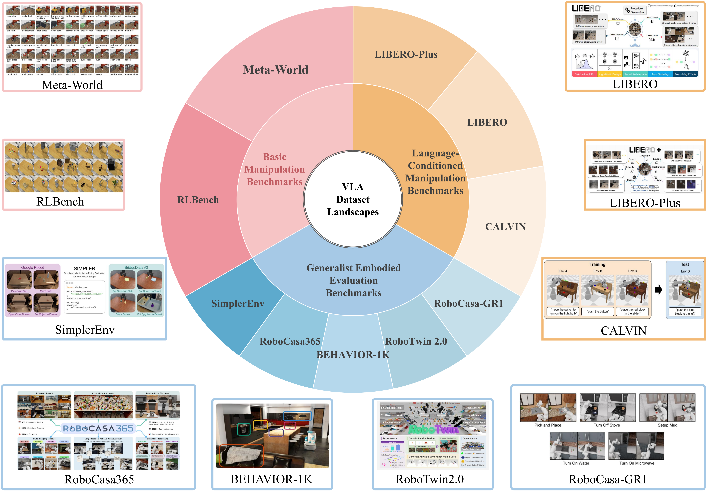
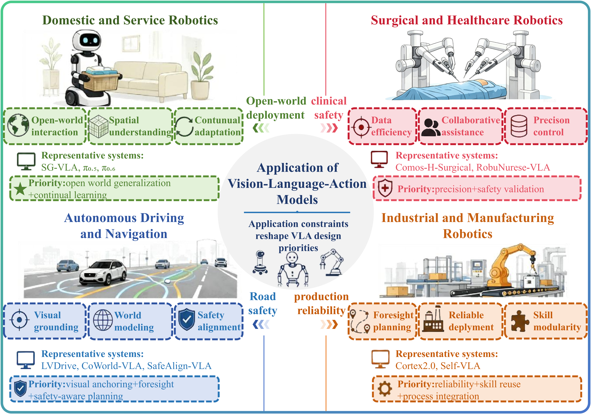
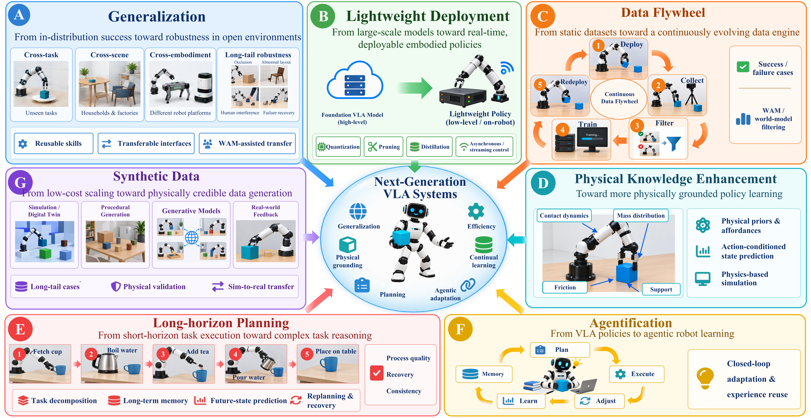

# 🤖 A Survey of Multi-Paradigm Approaches Toward General-Purpose Embodied Intelligence: A Panoramic Review and Evolutionary Trajectory

### 🌟 A comprehensive review of Vision-Language-Action Models and emerging paradigms for general-purpose embodied intelligence

Vision-Language-Action Models (VLAs) provide a unified framework that connects visual perception, language understanding, and robotic control.

This repository accompanies our survey, presenting a systematic review of the evolution of embodied intelligence, covering VLA architectures, efficient deployment, scene generalization, capability enhancement, and emerging predictive paradigms including Video-Action Models (VAMs) and World Action Models (WAMs).

---

## 📰 News

- `2026.08` Repository initialized.
- More updates will be released as the field evolves.

---

## 📌 Overview

This survey analyzes the evolutionary trajectory of general-purpose embodied intelligence from three perspectives:

- **🧩 VLA Architecture & Action Generation**
  - Autoregressive VLA
  - Diffusion-based VLA
  - Video-Action Models (VAMs)
  - World Action Models (WAMs)

- **⚡ Deployment & Generalization**
  - Model Efficiency
  - Scene Generalization

- **🧠 Capability Expansion**
  - Reinforcement Learning
  - World Models
  - Long-Horizon Reasoning

Fig. 1. Chronological roadmap and key milestones of VLAs and WAM (2022–2026). The figure depicts the four-stage evolution of embodied policy models—progressing from early language-conditioned control, open generalist VLAs, and reasoning-enhanced architectures, to video- and world-aware agents leveraging world dynamics.

---

## 📑 Table of Contents

- [🧩 VLA Architecture & Action Generation](#vla-architecture-action-generation)
  - [Autoregressive VLA](#autoregressive-vla)
  - [Diffusion-based VLA](#diffusion-based-vla)
  - [Video-Action Models (VAMs)](#video-action-models-vams)
  - [World Action Models (WAMs)](#world-action-models-wams)
  - [Datasets](#datasets)

- [⚡ Deployment & Generalization](#deployment-generalization)
  - [Model Efficiency](#model-efficiency)
  - [Scene Generalization](#scene-generalization)

- [🧠 Capability Expansion](#capability-expansion)
  - [Reinforcement Learning](#reinforcement-learning)
  - [World Models](#world-models)
  - [Long-Horizon Reasoning](#long-horizon-reasoning)

- [🏭 Applications](#applications)

- [🚧 Challenges and Future Directions](#challenges-and-future-directions)

- [📖 Citation](#citation)

## 🧩 VLA Architecture & Action Generation

VLAs have evolved from action-sequence prediction models toward predictive embodied models that incorporate future dynamics and world-state reasoning.

This section reviews four major model paradigms:

- Autoregressive VLA
- Diffusion-based VLA
- Video-Action Models (VAMs)
- World Action Models (WAMs)

Representative datasets and evaluation benchmarks are summarized separately at the end of this section.

Fig. 2. Architectural overview of VLAs. Encoding: Heterogeneous inputs are encoded and aligned via cross-modal fusion. Multimodal Reasoning: Transformer-based VLM/LLM backbones process fused latent features for high-level decision-making. Action Decoding: Latent representations are mapped into executable robot commands via direct regression, autoregressive prediction, or diffusion/flow matching.

### Autoregressive VLA

Autoregressive VLAs formulate robot action generation as conditional sequence prediction, representing actions as tokens or sequence units and predicting them causally from visual observations, language instructions, proprioceptive states, and historical context.

| Year | Venue | Paper | Website | Code |
|------|-------|-------|---------|------|
|2023|arXiv|[RT-2: Vision-Language-Action Models Transfer Web Knowledge to Robotic Control](https://arxiv.org/abs/2307.15818)|[🌐](https://robotics-transformer2.github.io/)|-|
|2024|arXiv|[Robotic Control via Embodied Chain-of-Thought Reasoning](https://arxiv.org/abs/2407.08693)|[🌐](https://embodied-cot.github.io/)|[💻](https://github.com/MichalZawalski/embodied-CoT/)|
|2024|arXiv|[RT-H: Action Hierarchies Using Language](https://arxiv.org/abs/2403.01823)|[🌐](https://rt-hierarchy.github.io/)|-|
|2025|arXiv|[CoT-VLA: Visual Chain-of-Thought Reasoning for Vision-Language-Action Models](https://arxiv.org/abs/2503.22020)|[🌐](https://cot-vla.github.io/)|-|
|2025|arXiv|[ChatVLA: Unified Multimodal Understanding and Robot Control with Vision-Language-Action Model](https://arxiv.org/abs/2502.14420)|[🌐](https://chatvla.github.io/)|[💻](https://github.com/tutujingyugang1/ChatVLA_public)|
|2025|arXiv|[Embodiment Transfer Learning for Vision-Language-Action Models](https://arxiv.org/abs/2511.01224)|[🌐](https://et-vla.github.io/)|[💻]-|
|2025|arXiv|[AutoVLA: A Vision-Language-Action Model for End-to-End Autonomous Driving with Adaptive Reasoning and Reinforcement Fine-Tuning](https://arxiv.org/abs/2506.13757)|[🌐](https://autovla.github.io/)|[💻](https://github.com/ucla-mobility/AutoVLA)|
|2025|arXiv|[LoHoVLA: A Unified Vision-Language-Action Model for Long-Horizon Embodied Tasks](https://arxiv.org/abs/2506.00411)|-|-|
|2026|arXiv|[Libra-VLA: Achieving Learning Equilibrium via Asynchronous Coarse-to-Fine Dual-System](https://arxiv.org/abs/2604.24921)|[🌐](https://libra-vla.github.io/)|-|
|2026|arXiv|[AR-VLA: True Autoregressive Action Expert for Vision-Language-Action Models](https://arxiv.org/abs/2603.10126)|[🌐](https://arvla.insait.ai/)|[💻](https://github.com/insait-institute/AR-VLA-lerobot)|

### Diffusion-based VLA

Diffusion-based and related continuous-generative VLAs model actions in continuous space through iterative denoising or flow-based generation, supporting smooth, fine-grained, and multimodal action trajectories for complex robotic control.

| Year | Venue | Paper | Website | Code |
|------|-------|-------|---------|------|
|2024|arXiv|[π0: A Vision-Language-Action Flow Model for General Robot Control](https://arxiv.org/abs/2410.24164)|[🌐](https://www.pi.website/blog/pi0)|-|
|2024|arXiv|[TinyVLA: Towards Fast, Data-Efficient Vision-Language-Action Models for Robotic Manipulation](https://arxiv.org/abs/2409.12514)|[🌐](https://tiny-vla.github.io/)|[💻](https://github.com/liyaxuanliyaxuan/TinyVLA)|
|2025|arXiv|[DexVLA: Vision-Language Model with Plug-In Diffusion Expert for General Robot Control](https://arxiv.org/abs/2502.05855)|[🌐](https://dex-vla.github.io/)|[💻](https://github.com/juruobenruo/DexVLA)|
|2025|arXiv|[SmolVLA: A Vision-Language-Action Model for Affordable and Efficient Robotics](https://arxiv.org/abs/2506.01844)|-|[💻](https://github.com/huggingface/lerobot)|
|2025|arXiv|[DreamVLA: A Vision-Language-Action Model Dreamed with Comprehensive World Knowledge](https://arxiv.org/abs/2507.04447)|-|[💻](https://github.com/Zhangwenyao1/DreamVLA)|
|2025|arXiv|[LLaDA-VLA: Vision Language Diffusion Action Models](https://arxiv.org/abs/2509.06932)|[🌐](https://wenyuqing.github.io/llada-vla/)|-|
|2025|arXiv|[dVLA: Diffusion Vision-Language-Action Model with Multimodal Chain-of-Thought](https://arxiv.org/abs/2509.25681)|-|-|
|2026|arXiv|[CF-VLA: Efficient Coarse-to-Fine Action Generation for Vision-Language-Action Policies](https://arxiv.org/abs/2604.24622)|-|[💻](https://github.com/EmbodiedAI-RoboTron/CF-VLA)|
|2026|arXiv|[Towards Deploying VLA without Fine-Tuning: Plug-and-Play Inference-Time VLA Policy Steering via Embodied Evolutionary Diffusion](https://arxiv.org/abs/2511.14178)|[🌐](https://rip4kobe.github.io/vla-pilot/)|-|
|2026|arXiv|[ProgressVLA: Progress-Guided Diffusion Policy for Vision-Language Robotic Manipulation](https://arxiv.org/abs/2603.27670)|-|-|

### Video Action Models (VAMs)

Video Action Models extend VLAs by jointly modeling future video dynamics and action sequences. By learning temporal evolution and interaction dynamics, VAMs provide predictive visual priors to improve embodied decision-making.

| Year | Venue | Paper | Website | Code |
|------|-------|-------|---------|------|
|2025|arXiv|[Unified Video Action Model](https://arxiv.org/abs/2503.00200)|[🌐](https://unified-video-action-model.github.io/)|-|
|2025|arXiv|[VILP [54]](https://arxiv.org/abs/2503.00200)|[🌐](https://unified-video-action-model.github.io/)|-|
|2025|arXiv|[ViPRA [55]](https://arxiv.org/abs/2503.00200)|[🌐](https://unified-video-action-model.github.io/)|-|
|2025|arXiv|[mimic-video [56] ](https://arxiv.org/abs/2503.00200)|[🌐](https://unified-video-action-model.github.io/)|-|
|2025|arXiv|[VideoVLA: Video Generators Can Be Generalizable Robot Manipulators](https://arxiv.org/abs/2512.06963)|[🌐](https://videovla-nips2025.github.io/)|[💻](https://github.com/VideoVLA-Project/VideoVLA)|
|2025|arXiv|[CoVAR [58](https://arxiv.org/abs/2512.06963)|[🌐](https://videovla-nips2025.github.io/)|[💻](https://github.com/VideoVLA-Project/VideoVLA)|
|2026|arXiv|[VERA [62] ](https://arxiv.org/abs/2512.06963)|[🌐](https://videovla-nips2025.github.io/)S-VAM [59] |[💻](https://github.com/VideoVLA-Project/VideoVLA)|
|2026|arXiv|[VTAM [60]  ](https://arxiv.org/abs/2512.06963)|[🌐](https://videovla-nips2025.github.io/)S-VAM [59] |[💻](https://github.com/VideoVLA-Project/VideoVLA)|
|2026|arXiv|[DiT4DiT: Jointly Modeling Video Dynamics and Actions for Generalizable Robot Control](https://arxiv.org/abs/2603.10448)|[🌐](https://dit4dit.github.io/)|[💻](https://github.com/Mondo-Robotics/DiT4DiT)|
|2026|arXiv|[S-VAM: Shortcut Video-Action Model by Self-Distilling Geometric and Semantic Foresight](https://arxiv.org/abs/2603.16195)|[🌐](https://haodong-yan.github.io/S-VAM/)|[💻](https://github.com/Haodong-Yan/S-VAM)|

### World Action Models (WAMs)

World Action Models extend embodied policies by integrating future world-state prediction with action generation. By learning predictive models of environment dynamics, WAMs enable more informed planning and decision-making for long-horizon robotic tasks.

| Year | Venue | Paper | Website | Code |
|------|-------|-------|---------|------|
|2025|arXiv|[Unified World Models: Coupling Video and Action Diffusion for Pretraining on Large Robotic Datasets](https://arxiv.org/abs/2504.02792)|[🌐](https://weirdlabuw.github.io/uwm/)|[💻](https://github.com/WEIRDLabUW/unified-world-model)|
|2026|arXiv|[DreamDojo [64] ](https://arxiv.org/abs/2603.16666)|[🌐](https://yuantianyuan01.github.io/FastWAM/)|[💻](https://github.com/yuantianyuan01/FastWAM)|
|2026|arXiv|[Fast-WAM: Do World Action Models Need Test-time Future Imagination?](https://arxiv.org/abs/2603.16666)|[🌐](https://yuantianyuan01.github.io/FastWAM/)|[💻](https://github.com/yuantianyuan01/FastWAM)|
|2026|arXiv|[X-WAM [66] ](https://arxiv.org/abs/2603.16666)|[🌐](https://yuantianyuan01.github.io/FastWAM/)|[💻](https://github.com/yuantianyuan01/FastWAM)|
|2026|arXiv|[Latent-WAM [70] ](https://arxiv.org/abs/2603.16666)|[🌐](https://yuantianyuan01.github.io/FastWAM/)|[💻](https://github.com/yuantianyuan01/FastWAM)|
|2026|arXiv|[CKT-WAM [69]  ](https://arxiv.org/abs/2603.16666)|[🌐](https://yuantianyuan01.github.io/FastWAM/)|[💻](https://github.com/yuantianyuan01/FastWAM)|
|2026|arXiv|[OA-WAM: Object-Addressable World Action Model for Robust Robot Manipulation](https://arxiv.org/abs/2605.06481)|-|-|
|2026|arXiv|[τ0-WM [71] ](https://arxiv.org/abs/2605.06481)|-|-|
|2026|arXiv|[HarmoWAM: Harmonizing Generalizable and Precise Manipulation via Adaptive World Action Models](https://arxiv.org/abs/2605.10942)|[🌐](https://elbb-yu.github.io/HarmoWAM/)|-|

### Datasets

Datasets and benchmarks for VLAs have evolved from basic manipulation toward language-conditioned control, long-horizon planning, robustness evaluation, and multi-embodiment transfer. This section highlights five representative benchmarks discussed in the survey.

| Dataset | Year | Domain | Website | Code |
|---------|------|--------|---------|------|
| [Meta-World](https://arxiv.org/abs/1910.10897) | 2021 | Multi-task robotic manipulation with 50 simulated tasks | [🌐](https://meta-world.github.io/) | [💻](https://github.com/Farama-Foundation/Metaworld) |
| [LIBERO](https://arxiv.org/abs/2306.03310) | 2023 | Lifelong robot learning with diverse language-conditioned manipulation tasks | [🌐](https://libero-project.github.io/intro.html) | -  |
| [LIBERO-Plus](https://arxiv.org/abs/2510.13626) | 2025 | Robust VLA evaluation under environmental perturbations and distribution shifts | [🌐](https://sylvestf.github.io/LIBERO-plus/) |[💻](https://github.com/sylvestf/LIBERO-plus) |
| [RoboTwin 2.0](https://arxiv.org/abs/2506.18088) | 2025 | Bimanual manipulation with diverse object interaction scenarios | [🌐](https://robotwin-platform.github.io/) | [💻](https://github.com/robotwin-Platform/robotwin) |
| [CALVIN](https://arxiv.org/abs/2112.03227) | 2022 | Long-horizon language-conditioned robotic manipulation | [🌐](http://calvin.cs.uni-freiburg.de/) | - |

Fig. 3. Landscape of dataset and evaluation benchmarks for generalist
VLAs. Overview of VLA evaluation frameworks categorized into basic
manipulation benchmarks, language-conditioned manipulation benchmarks,
 and generalist embodied evaluation benchmarks. Outer visual
callouts illustrate representative simulation setups and environment
dynamics.

---

## ⚡ Deployment & Generalization

Large-scale VLAs face challenges in computational efficiency and robust adaptation when deployed in real-world environments.

This section reviews approaches toward practical deployment and robust generalization, including:

- Model efficiency
    - Visual token pruning
    - Quantization
    - Knowledge distillation

- Scene generalization
    - Spatial-geometric perception and object-centric representation
    - World-model-assisted generalization
    - Inference-time intervention and multi-skill composition

### Model Efficiency

Model efficiency approaches reduce VLA computational and memory overhead through visual token pruning, low-precision quantization, and knowledge distillation.

#### Visual Token Pruning

| Year | Venue | Paper | Website | Code |
|------|-------|-------|---------|------|
|2025|arXiv|[Action-aware Dynamic Pruning for Efficient Vision-Language-Action Manipulation](https://arxiv.org/abs/2509.22093)|-|[💻](https://github.com/TerryPei/VLA-ADP)|
|2025|arXiv|[SP-VLA: A Joint Model Scheduling and Token Pruning Approach for VLA Model Acceleration](https://arxiv.org/abs/2506.12723)|-|-|
|2025|arXiv|[LightVLA [100]  ](https://arxiv.org/html/2511.16449v1)|-|-|
|2025|arXiv|[SpecPrune-VLA [96]  ](https://arxiv.org/html/2511.16449v1)|-|-|
|2026|arXiv|[BFA++: Hierarchical Best-Feature-Aware Token Prune for Multi-View Vision Language Action Model](https://arxiv.org/abs/2602.20566)|-|-|
|2026|arXiv|[ETA-VLA: Efficient Token Adaptation via Temporal Fusion and Intra-LLM Sparsification for Vision-Language-Action Models](https://arxiv.org/abs/2603.25766)|-|-|
|2026|arXiv|[VLA-Pruner: Temporal-Aware Dual-Level Visual Token Pruning for Efficient Vision-Language-Action Inference](https://arxiv.org/html/2511.16449v1)|-|-|
|2026|arXiv|[DeepVision-VLA [97] ](https://arxiv.org/html/2511.16449v1)|-|-|
|2026|arXiv|[CogVLA [101] ](https://arxiv.org/html/2511.16449v1)|-|-|
|2026|arXiv|[VLA-IAP [93] ](https://arxiv.org/html/2511.16449v1)|-|-|

#### Quantization

| Year | Venue | Paper | Website | Code |
|------|-------|-------|---------|------|
|2024|arXiv|[Quantization-Aware Imitation-Learning for Resource-Efficient Robotic Control](https://arxiv.org/abs/2412.01034)|-|-|
|2025|arXiv|[SQAP-VLA: A Synergistic Quantization-Aware Pruning Framework for High-Performance Vision-Language-Action Models](https://arxiv.org/abs/2509.09090)|-|[💻](https://github.com/ecdine/SQAP-VLA)|
|2025|arXiv|[SQIL [112] ](https://arxiv.org/abs/2509.09090)|-|[💻](https://github.com/ecdine/SQAP-VLA)|
|2026|arXiv|[QVLA: Not All Channels Are Equal in Vision-Language-Action Model's Quantization](https://arxiv.org/abs/2602.03782)|-|[💻](https://github.com/AutoLab-SAI-SJTU/QVLA)|
|2026|arXiv|[DyQ-VLA: Temporal-Dynamic-Aware Quantization for Embodied Vision-Language-Action Models](https://arxiv.org/abs/2603.07904)|-|-|
|2026|arXiv|[BitVLA: 1-bit Vision-Language-Action Models for Robotics Manipulation](https://arxiv.org/abs/2506.07530v1)|-|[💻](https://github.com/ustcwhy/BitVLA)|
|2026|arXiv|[QuantVLA [106]](https://arxiv.org/abs/2509.09090)|-|[💻](https://github.com/ecdine/SQAP-VLA)|
|2026|arXiv|[DA-PTQ [107] ](https://arxiv.org/abs/2509.09090)|-|[💻](https://github.com/ecdine/SQAP-VLA)|
|2026|arXiv|[LiteVLA-Edge [109] ](https://arxiv.org/abs/2509.09090)|-|[💻](https://github.com/ecdine/SQAP-VLA)|
|2026|arXiv|[HBVLA [110] ](https://arxiv.org/abs/2509.09090)|-|[💻](https://github.com/ecdine/SQAP-VLA)|

#### Knowledge Distillation

| Year | Venue | Paper | Website | Code |
|------|-------|-------|---------|------|
|2025|arXiv|[DualVLA: Building a Generalizable Embodied Agent via Partial Decoupling of Reasoning and Action](https://arxiv.org/abs/2511.22134)|[🌐](https://costaliya.github.io/DualVLA/)|-|
|2025|arXiv|[VITA-VLA [115] ](https://arxiv.org/abs/2511.22134)|[🌐](https://costaliya.github.io/DualVLA/)|-|
|2026|arXiv|[ActDistill: General Action-Guided Self-Derived Distillation for Efficient Vision-Language-Action Models](https://arxiv.org/abs/2511.18082)|-|-|
|2026|arXiv|[SnapFlow: One-Step Action Generation for Flow-Matching VLAs via Progressive Self-Distillation](https://arxiv.org/abs/2604.05656)|-|-|
|2026|arXiv|[Shallow-π: Knowledge Distillation for Flow-based VLAs](https://arxiv.org/abs/2601.20262)|[🌐](https://icsl-jeon.github.io/shallow-pi/)|[💻](https://github.com/icsl-Jeon/openpi)|
|2026|arXiv|[DySL-VLA: Efficient Vision-Language-Action Model Inference via Dynamic-Static Layer-Skipping for Robot Manipulation](https://arxiv.org/abs/2602.22896)|-|[💻](https://github.com/PKU-SEC-Lab/DYSL_VLA)|
|2026|arXiv|[HY-Embodied-0.5 [119] ](https://arxiv.org/abs/2602.22896)|-|[💻](https://github.com/PKU-SEC-Lab/DYSL_VLA)|
|2026|arXiv|[AC2-VLA](https://arxiv.org/abs/2602.22896)|-|[💻](https://github.com/PKU-SEC-Lab/DYSL_VLA)|

### Scene Generalization

To address VLA performance degradation in out-of-distribution environments, current methods mainly follow three routes: spatial-geometric perception, world-model-assisted prediction, and inference-time intervention with multi-skill composition.

| Year | Venue | Paper | Website | Code |
|------|-------|-------|---------|------|
|2024|arXiv|[OpenVLA: An Open-Source Vision-Language-Action Model](https://arxiv.org/abs/2406.09246)|[🌐](https://openvla.github.io/)|[💻](https://github.com/openvla/openvla)|
|2025|arXiv|[WorldVLA: Towards Autoregressive Action World Model](https://arxiv.org/abs/2506.21539)|-|[💻](https://github.com/alibaba-damo-academy/RynnVLA-002)|
|2025|arXiv|[π0[5]](https://arxiv.org/abs/2506.21539)|-|[💻](https://github.com/alibaba-damo-academy/RynnVLA-002)|
|2025|arXiv|[π0-Fast[33]](https://arxiv.org/abs/2506.21539)|-|[💻](https://github.com/alibaba-damo-academy/RynnVLA-002)|
|2025|arXiv|[UniVLA: Learning to Act Anywhere with Task-centric Latent Actions](https://arxiv.org/abs/2505.06111)|-|[💻](https://github.com/OpenDriveLab/UniVLA)|
|2026|arXiv|[VLA-JEPA: Enhancing Vision-Language-Action Model with Latent World Model](https://arxiv.org/abs/2602.10098)|[🌐](https://ginwind.github.io/VLA-JEPA/)|[💻](https://github.com/ginwind/VLA-JEPA)|
|2026|arXiv|[MergeVLA [137] ](https://arxiv.org/abs/2602.10098)|[🌐](https://ginwind.github.io/VLA-JEPA/)|[💻](https://github.com/ginwind/VLA-JEPA)|
|2026|arXiv|[JEPA-VLA [129] ](https://arxiv.org/abs/2602.10098)|[🌐](https://ginwind.github.io/VLA-JEPA/)|[💻](https://github.com/ginwind/VLA-JEPA)|
|2026|arXiv|[OA-WAM [68] ](https://arxiv.org/abs/2602.10098)|[🌐](https://ginwind.github.io/VLA-JEPA/)|[💻](https://github.com/ginwind/VLA-JEPA)|
|2026|arXiv|[StarVLA-α: Reducing Complexity in Vision-Language-Action Systems](https://arxiv.org/abs/2604.11757)|-|[💻](https://github.com/starVLA/starVLA)|

---

## 🧠 Capability Expansion

To overcome the limitations of imitation learning, recent studies extend VLA capabilities with interactive learning, predictive modeling, and long-horizon decision-making.

This section covers:

- Reinforcement learning
- World models
- Long-horizon reasoning

### Reinforcement Learning

Reinforcement learning enhances VLA capabilities beyond imitation learning by optimizing policies through environment interaction. These approaches improve task performance, adaptation ability, and autonomous decision-making through reward-driven learning.

| Year | Venue | Paper | Website | Code |
|------|-------|-------|---------|------|
|2025|arXiv|[GR-RL: Going Dexterous and Precise for Long-Horizon Robotic Manipulation](https://arxiv.org/abs/2512.01801)|[🌐](https://seed.bytedance.com/en/gr_rl)|-|
|2025|arXiv|[PLD [148] ](https://arxiv.org/abs/2512.01801)|[🌐](https://seed.bytedance.com/en/gr_rl)|-|
|2025|arXiv|[RPD [151] ](https://arxiv.org/abs/2512.01801)|[🌐](https://seed.bytedance.com/en/gr_rl)|-|
|2025|arXiv|[VLA-RL: Towards Masterful and General Robotic Manipulation with Scalable Reinforcement Learning](https://arxiv.org/abs/2505.18719)|-|[💻](https://github.com/GuanxingLu/vlarl)|
|2025|arXiv|[SimpleVLA-RL: Scaling VLA Training via Reinforcement Learning](https://arxiv.org/abs/2509.09674)|-|[💻](https://github.com/PRIME-RL/SimpleVLA-RL)|
|2026|arXiv|[VLA-OPD: Bridging Offline SFT and Online RL for Vision-Language-Action Models via On-Policy Distillation](https://arxiv.org/abs/2603.26666)|[🌐](https://irpn-lab.github.io/VLA-OPD/)|-|
|2026|arXiv|[πRL: Online RL Fine-tuning for Flow-based Vision-Language-Action Models](https://arxiv.org/abs/2510.25889)|-|[💻](https://github.com/RLinf/RLinf)|
|2026|arXiv|[IG-RFT [144] ](https://arxiv.org/abs/2510.25889)|-|[💻](https://github.com/RLinf/RLinf)|
|2026|arXiv|[RL-VLA3](https://arxiv.org/abs/2510.25889)|-|[💻](https://github.com/RLinf/RLinf)|
|2026|arXiv|[LongNav-R1 [152] ](https://arxiv.org/abs/2510.25889)|-|[💻](https://github.com/RLinf/RLinf)|

### World Models

World models enhance VLA capabilities by learning predictive representations of environment dynamics. By modeling future states and interactions, these approaches provide additional reasoning signals for planning, decision-making, and policy improvement.

| Year | Venue | Paper | Website | Code |
|------|-------|-------|---------|------|
|2025|arXiv|[OSVI-WM [160] ](https://arxiv.org/abs/2505.11528)|-|[💻](https://github.com/GuHuangAI/LaDiWM)|
|2025|arXiv|[LaDi-WM: A Latent Diffusion-based World Model for Predictive Manipulation](https://arxiv.org/abs/2505.11528)|-|[💻](https://github.com/GuHuangAI/LaDiWM)|
|2025|arXiv|[PIN-WM: Learning Physics-INformed World Models for Non-Prehensile Manipulation](https://arxiv.org/abs/2504.16693)|[🌐](https://pinwm.github.io/)|[💻](https://github.com/XuAdventurer/PIN-WM)|
|2026|arXiv|[EA-WM: Event-Aware Generative World Model with Structured Kinematic-to-Visual Action Fields](https://arxiv.org/abs/2605.06192)|-|-|
|2026|arXiv|[Hi-WM: Human-in-the-World-Model for Scalable Robot Post-Training](https://arxiv.org/abs/2604.21741)|[🌐](https://hi-wm.github.io/)|-|
|2026|arXiv|[H-WM: Robotic Task and Motion Planning Guided by Hierarchical World Model](https://arxiv.org/abs/2602.11291)|-|-|
|2026|arXiv|[WM-DAgger [162] ](https://arxiv.org/abs/2602.11291)|-|-|
|2026|arXiv|[ContactGaussian-WM [156] ](https://arxiv.org/abs/2602.11291)|-|-|
|2026|arXiv|[DDP-WM [155] ](https://arxiv.org/abs/2602.11291)|-|-|
|2026|arXiv|[WoVR [163] ](https://arxiv.org/abs/2602.11291)|-|-|

### Long-Horizon Reasoning

Long-horizon reasoning enhances VLA capabilities for complex multi-step tasks by introducing hierarchical planning, memory mechanisms, progress monitoring, and failure recovery strategies.

| Year | Venue | Paper | Website | Code |
|------|-------|-------|---------|------|
|2026|arXiv|[Non-Markovian Long-Horizon Robot Manipulation via Keyframe Chaining](https://arxiv.org/abs/2603.01465)|-|[💻](https://github.com/cytoplastm/KC-VLA)|
|2026|arXiv|[LiLo-VLA: Compositional Long-Horizon Manipulation via Linked Object-Centric Policies](https://arxiv.org/abs/2602.21531)|[🌐](https://yy-gx.github.io/LiLo-VLA/)|[💻](https://github.com/YY-GX/LiLo-VLA)|
|2026|arXiv|[BagelVLA: Enhancing Long-Horizon Manipulation via Interleaved Vision-Language-Action Generation](https://arxiv.org/abs/2602.09849)|[🌐](https://cladernyjorn.github.io/BagelVLA.github.io/)|-|
|2026|arXiv|[AtomVLA: Scalable Post-Training for Robotic Manipulation via Predictive Latent World Models](https://arxiv.org/abs/2603.08519)|-|-|
|2026|arXiv|[Anticipation-VLA: Solving Long-Horizon Embodied Tasks via Anticipation-based Subgoal Generation](https://arxiv.org/abs/2605.01772)|-|-|
|2026|arXiv|[LoHo-Manip [166] ](https://arxiv.org/abs/2605.01772)|-|-|
|2026|arXiv|[VQ-Memory [169] ](https://arxiv.org/abs/2605.01772)|-|-|
|2026|arXiv|[TempoFit [170] ](https://arxiv.org/abs/2605.01772)|-|-|
|2026|arXiv|[HELM [168] ](https://arxiv.org/abs/2605.01772)|-|-|
|2026|arXiv|[Goal2Skill [174] ](https://arxiv.org/abs/2605.01772)|-|-|

Fig. 4. Taxonomic overview of technical routes for VLA model efficiency, scene generalization, and capability expansion. It outlines the core research directions of VLAs: enhancing model efficiency via pruning, quantization, and knowledge distillation; overcoming scene generalization bottlenecks by leveraging spatial geometric perception and adaptation; and exploring emerging capability expansion through reinforcement learning, world models, and long-horizon tasks.

---

## 🏭 Applications

Representative applications include:

🏠 Household and Service Robots

🏥 Surgical and Medical Assistance Robots

🚗 Autonomous Driving and Navigation

🏭 Industrial and Manufacturing Robots

Fig. 5. Application landscape and design priorities of Vision-Language-Action (VLA) models across four representative domains. A systematic overview of VLA model deployment topologies across domestic service (5.1), surgical operations (5.2), autonomous driving (5.3), and industrial manufacturing (5.4). The diagram illustrates how practical domain requirements—such as open-environment adaptation, clinical safety, road safety, and production reliability—determine the design priorities of VLA models, directing them toward generalization, control precision, foresight planning, and skill reuse, respectively, alongside representative systems in each field.

---

## 🚧 Challenges and Future Directions

Despite rapid progress in Vision-Language-Action models, significant gaps remain before achieving general-purpose embodied intelligence. Current VLAs still face challenges in robustness, deployment, continual adaptation, and autonomous decision-making. This section summarizes the major challenges and future research directions toward reliable embodied agents.

### Challenges

#### 🌍 Limitations in Cross-Scene Generalization

Current VLAs often perform stably within the training distribution but degrade on unseen tasks, scenes, robot embodiments, and long-tail perturbations. The bottleneck involves not only visual encoding, but also object-relation modeling, spatial-language grounding, and cross-embodiment action alignment.

#### 🧠 Fragility in Long-Horizon Task Execution

Long-horizon failures arise from the lack of verifiable task-progress representations and closed-loop recovery mechanisms. Errors at key stages can propagate through the execution chain, while historical states are difficult to retrieve and use reliably.

#### ⚡ Bottlenecks in Lightweight Deployment and Real-Time Control

Large vision-language backbones introduce inference latency that conflicts with real-time closed-loop control and edge deployment. Extreme compression, task-adaptive computation, asynchronous inference, and hierarchical slow-planning/fast-execution architectures remain insufficiently mature.

#### 🔄 Lack of Continual Learning Ability under the Static-Data Paradigm

Most VLAs are trained once on static offline datasets and lack a stable mechanism for recycling new tasks, failures, and recovery experiences encountered after deployment.

#### 🌐 Insufficient Modeling of Physical Laws

Current VLAs rely heavily on statistical learning and lack explicit modeling of contact dynamics, support relations, friction, mass distribution, and other physical constraints that determine action consequences.

#### 🤖 Lack of Embodied Agentic Capability

Task decomposition, long-term memory, tool invocation, active exploration, and human-robot collaboration are still typically implemented through separate modules, while unified coordination among high-level reasoning, VLA execution, and world models remains incomplete.

#### 📚 Scarcity of Real-World Data and Insufficient Credibility of Alternative Data Sources

Real-robot data are costly and difficult to scale, while human-video and simulation data face cross-embodiment mapping and sim-to-real gaps. Both also lack a stable mapping from visual dynamics to executable robot actions.

---

### Future Directions

#### 🌍 Generalization: From In-Distribution Success Toward Robustness in Open Environments

Future VLAs should improve cross-task, cross-scene, cross-embodiment, and long-tail robustness, shifting evaluation from fixed-benchmark success toward stable and reliable behavior in open environments.

#### ⚡ Lightweight Deployment: From Large-Scale Models Toward Real-Time, Deployable Embodied Policies

Future systems should combine model compression with action chunking, asynchronous inference, streaming control, and hierarchical architectures in which large models reason at a high level while lightweight controllers execute in real time.

#### 🔄 Data Flywheel: From Static Datasets Toward a Continuously Evolving Data Engine

Future embodied systems should continuously collect deployment successes and failures, filter useful trajectories, retrain policies, and redeploy improved models to form a closed-loop data engine for continual learning.

#### 🌐 Physical Knowledge Enhancement: From Data-Driven Toward Modeling Physical Laws

Future VLAs should incorporate physical priors, affordance knowledge, world-model prediction, and physically grounded simulation to better model support, friction, mass, contact, and action consequences.

#### 🧠 Long-Horizon Planning: From Short-Horizon Task Execution Toward Complex Task Reasoning

Future systems should integrate hierarchical planning, long-term memory, closed-loop replanning, reflection, and future-state evaluation to improve consistency and recovery in multi-stage tasks.

#### 🤖 Agentification: From VLA Policy Models Toward Autonomous Embodied Agents

VLAs are expected to become execution components within autonomous embodied agents that combine high-level reasoning, memory, tool use, world-model prediction and verification, active exploration, and human-robot collaboration.

#### 📚 Synthetic Data: From Low-Cost Scaling Toward Physically Credible Data Generation

Synthetic data should move beyond low-cost scaling toward physically credible, targeted generation of long-tail and failure cases, calibrated through real-world feedback and integrated with data flywheels and world models.

Fig. 6. Open research directions and critical challenges in VLAs. The seven pathways are open-world generalization, lightweight deployment and real-time control, continuous data flywheels, physical knowledge enhancement, long-horizon planning and memory, autonomous embodied agentization, and physically faithful synthetic data generation.

---

## 📖 Citation

If you find this survey useful, please consider citing:
